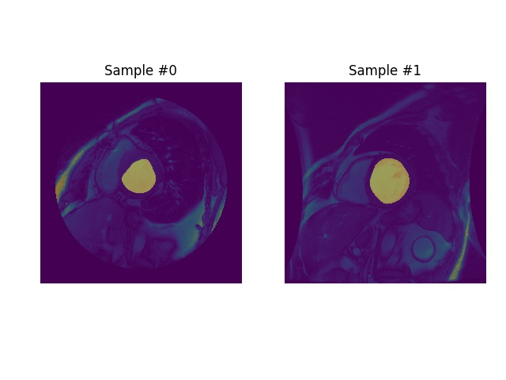

# dicom_data_pipeline : A production quality data pipeline for DICOM images segmentation.

----

## Installation

```bash
$ git clone repo-url
$ cd repo-dir/dicom_data_pipeline
$ chmod +x get_started.sh
$ ./get_started.sh
```


## How to run

Make sure every script is ran from the directory dicom_data_pipeline/dicom_data_pipeline.

## Part 1 : Data Parsing

The DataParser block of the pipe takes as inputs the raw dicom files and contour files, correlate each dicom file
with its corresponding contour file (if any). Then extract the numpy array of the dicom image and the numpy boolean
mask of the contours. This pair is then saved to the disk in 2 different folders with references to their paths saved
in a separate file : dicom_data_pipeline/_data/image-mask-pairs-i-contours.csv .


### How did you verify that you are parsing the contours correctly?

- By testing some important functions in the DataParser class.
- Also, very important by plotting few images of the merged(dicom + mask) to see if they correspond during data_parsing.
- The images for visual "debugging" are saved in the directory:  dicom_data_pipeline/dicom_data_pipeline/_plots .

### What changes did you make to the code, if any, in order to integrate it into our production code base?

- Added InvalidContourError Exception to parse_contour_file to make sure that a contour has at least 3 points.
- In parse_dicom_file, returned directly the image instead of returning a dict containing as single element that image.
- Also, replaced the return None statement in parse_dicom_file by a raise exception.
- Delayed the captured of the exceptions in those functions to higher level functions and logged trace in case of error


## Part 2 : Data loading

This block of the pipe leverages on the outputs (which are already tested) of the previous block to create an
efficient and parallelizable data loading mechanism using the super cool Pytorch's Dataset and Dataloader classes.


### Did you change anything from the pipelines built in Parts 1 to better streamline the pipeline built in Part 2? If so, what? If not, is there anything that you can imagine changing in the future?

- No, nothing at all was changed from the previous block since they communicate through files saved to disk only.
This is a good design choice since each block can be implemented/tested independently of the other given that the communication protocol (here the outputs format of the
first block) is understood by each.

- In the future we may want to handle the o-contours instead. This can be very easily handled by just changing the default parameter --contour_type
  in the run__data_parser.py script from i-contours to o-contours .


### How do you/did you verify that the pipeline was working correctly?

- Again, unit tests have been implemented for the 2 classes in the data_loader.py module.
- Amongst others, these unit tests, ensure that the data shapes and types are consistent.
- Same as before, some plots are generated for visually checking if the loading procedure is ok.
 These can be found in the directory :  dicom_data_pipeline/tests/data .
 - Hence, we can check for randomness by running the test several times and confirming that the save file looks different
 Each time.
 - Furthermore, we can play we the batch_size and visually confirm by looking at the generated batch's image .
 - Since we already tested the first block above, we can safely conclude that the pipeline as a whole parses and loads the data
 correctly.
 - Finally, one little cool feature of the data_loader is the ability to choose between loading a batch as a Pytorch Tensor or numpy arrays(requested type).

<p align="center"></p>
FIGURE: Image generated when testing the DicomMaskPairsDataset class.


<p align="center"></p>
FIGURE: Image generated when testing the DataLoaderFactory class.

In the later image, we can see the number of images in the figure corresponds to the batch_size specified in the test case.


 ### Given the pipeline you have built, can you see any deficiencies that you would change if you had more time? If not, can you think of any improvements/enhancements to the pipeline that you could build in?

- Something worth investigating is what if the dicom images have different sizes, in this scenario our data_loader default settings wont work.
However, thanks to Pytorch flexibility, this could be easily solved by adding a transform function to normalize the images' sizes when creating the dataset or dataloader objects.

- Another venue is what if we want to jointly train the segmentation model given the i-contours and o-contours.
 Huuum, unfortunately in this scenario, we would have to redesign the whole project.


